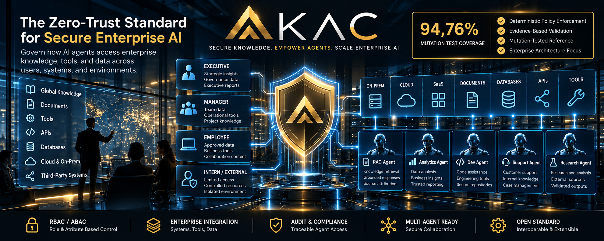
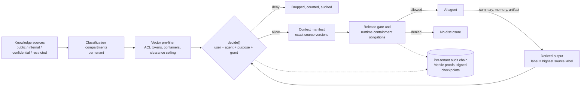

<p align="center">
  
</p>

# AKAC

**Agent Knowledge Access Control: a specification and reference implementation for controlling what AI agents may read, derive, remember and disclose.**

[](https://github.com/oemer-coskun/AKAC/actions/workflows/ci.yml)
[](https://github.com/oemer-coskun/AKAC/actions/workflows/formal.yml)
[](https://scorecard.dev/viewer/?uri=github.com/oemer-coskun/AKAC)
[](LICENSE)
[](spec/AKAC-0.6.md)

**Status:** reference `0.6.0`, specification `0.6-draft`. A working research and engineering reference. It is not certified, not an established standard, and has had no external security review, penetration test or audit ([what is and is not done](#assurance)).

## Why AKAC

An agent that may read a restricted document can write a summary of it, and most systems treat that summary as ordinary, unlabelled text. A memory entry, an embedding, a report or a tool call can then carry the same content to a person who could never have opened the source. Access control on the source does not follow the content once it is derived. AKAC closes this gap by making every read, derivation, memory write, share and export the same deterministic decision. Every derived object carries a classification of at least the highest of its sources, and every source is re-checked at every use.

## How it works



The vector index only narrows what is searched; `decide()` re-checks every candidate before any content leaves the gateway. Model output, document text and agent memory can never change identities, grants, labels or policy. Retrieval details: [RETRIEVAL.md](docs/RETRIEVAL.md). Architecture: [ARCHITECTURE.md](docs/ARCHITECTURE.md). Rules: [specification 0.6](spec/AKAC-0.6.md).

## Security classes

Four classes bundle features and obligations by the assurance a deployment needs. A class is a configuration bundle, not a certification. Full feature matrix: [SECURITY-CLASSES.md](docs/profiles/SECURITY-CLASSES.md). SK-1 runs with Docker Compose ([SK-1.md](docs/SK-1.md)); SK-2 to SK-4 deployments are part of the full package.

| Class | Typical use | Threat assumption | Key required features |
|---|---|---|---|
| SK-1 Basis | Team assistant over unregulated material | Honest operators, curious insiders, accidental over-sharing, prompt injection | Core `decide()`, tenant and compartment separation, audit chain |
| SK-2 Enterprise | Multi-tenant SaaS or company-wide deployment | ISO/IEC 27001 or SOC 2 style controls | PostgreSQL with forced RLS, shared state and replicas, signed checkpoints, destination profiles, cascade erasure |
| SK-3 Regulated | Finance, health, legal, insurance | Regulated data, audits, incident reporting | SK-2 plus DPoP tokens, external anchoring, runtime containment, crypto-erasure, dual control, residency gates, PQ-hybrid checkpoints |
| SK-4 High-Assurance | Classified or export-controlled material, critical infrastructure, crown-jewel IP | Targeted, well-resourced attacker | SK-3 plus dedicated restricted database, in-boundary embeddings, HSM custody (operator item), hourly verification |

Nothing in AKAC makes a deployment compliant with any law.

## Editions

This repository is the Community edition (MIT-0): decision semantics, the reference gateway, the conformance suite and the extension points (hooks that can only narrow a decision and fail closed). Every feature a security class requires is testable here. See [EDITIONS.md](docs/EDITIONS.md).

## Full package

The public repository contains the specification, reference gateway and evidence; the full package adds the following. Inquiries via [CONTACT.md](CONTACT.md).

- Industry profiles: financial services, healthcare, legal, manufacturing IP, public sector, research and education, SaaS platforms
- Production deployment: Helm chart and presets for SK-2 to SK-4
- High availability, backup and disaster recovery runbooks
- Key custody and HSM/KMS integration guidance
- Security operations: monitoring, alerting, incident playbooks
- Retention and erasure operations
- Integrations: MCP resource gateway, LangChain retriever, OpenAI-compatible proxy, TypeScript SDK
- Enterprise hook implementations: PII redaction, content sanitizing, canary tokens, semantic no-go rules, anomaly scoring, policy analysis
- Add-on modules: hybrid retrieval, multimodal, approval workflow, policy replay, transparency export, classification mapping, policy adapters, passage-level control, sandbox runtime profiles
- Detailed threat models: STRIDE, LINDDUN privacy, agentic threats
- Regulatory control mapping
- Confidential-computing (TEE) guidance
- Research directions and roadmap
- Assurance preparation: external audit, OpenSSF

## What's in the box

**Specification and conformance**
- Normative [specification 0.6](spec/AKAC-0.6.md) building on [0.5](spec/AKAC-0.5.md), [0.4](spec/AKAC-0.4.md), [0.3](spec/AKAC-0.3.md), [0.2](spec/AKAC-0.2.md) and [0.1](spec/AKAC-0.1.md); [conformance profiles](spec/CONFORMANCE.md), [change control](spec/CHANGE-CONTROL.md), [errata](spec/ERRATA.md), [wire schemas](schemas/).
- Portable JSON vectors, a language-neutral fixture, a rule-coverage matrix and mutation testing ([CONFORMANCE-COVERAGE.md](docs/CONFORMANCE-COVERAGE.md)).

**Reference gateway**
- TypeScript gateway with SQLite and in-memory development stores and a PostgreSQL adapter (forced row-level security, per-tenant locks, checksum-verified migrations); agent, admin and optional AuthZEN listeners with OpenAPI ([agent](docs/openapi.json), [admin](docs/openapi-admin.json), [AuthZEN](docs/openapi-authzen.json)).
- Permission-aware vector retrieval with per-compartment tables ([ADR-004](governance/ADR-004-knowledge-base-partitioning.md)).

**Identity and authority**
- Hierarchical roles, groups, static and dynamic separation of duty; bounded delegation that can only narrow; heartbeat-bound grants; RFC 8693 actor chains; approval quorum and break-glass grants; a risk-signal hook that can lower clearance; DPoP ([ADR-019](governance/ADR-019-identity-and-authority.md), [AUTHZEN.md](docs/AUTHZEN.md)).

**Knowledge semantics**
- Knowledge bases, folders, inherited audiences and floors; derivation and memory inheritance with a lineage depth limit; quarantine, retention, legal hold, cascade erasure; modality, residency and tag attributes; combination rules; ephemeral session knowledge; model lineage ([ADR-022](governance/ADR-022-knowledge-semantics.md)).

**Release and retrieval protection**
- Release gate, destination profiles, write-down rule, release-filter and sanitizer hooks, timing equalisation, volume budgets, embedding anchors ([RELEASE-PROTECTION.md](docs/RELEASE-PROTECTION.md), [ADR-020](governance/ADR-020-release-and-retrieval-protection.md)).

**Runtime containment**
- A vendor-neutral obligation contract (`runtime_profile`, `max_output_classification`) with an enforcer seam: AKAC decides, the runtime enforces ([RUNTIME-CONTAINMENT.md](docs/RUNTIME-CONTAINMENT.md), [ADR-012](governance/ADR-012-runtime-containment-contract.md)).

**Evidence and cryptography**
- Decision ids, closed reason codes, hash-chained audit (RFC 8785, RFC 9162 proofs), signed checkpoints, crypto agility with ML-DSA, SLH-DSA and an Ed25519 + ML-DSA-65 hybrid, content encryption with crypto-erasure ([CRYPTO-AGILITY.md](docs/CRYPTO-AGILITY.md), [ADR-021](governance/ADR-021-crypto-agility-and-pq.md)). No cryptographic review has taken place and no module is FIPS-validated.

**Operations**
- Docker Compose deployment (SK-1) with PostgreSQL, pgvector and OPA, shared state for several replicas, backup drill, Prometheus metrics ([SK-1.md](docs/SK-1.md), [PERFORMANCE.md](docs/PERFORMANCE.md), [SUPPORT-MATRIX.md](docs/SUPPORT-MATRIX.md)).

**Implementations**
- TypeScript reference (`reference/`) and a Python implementation ([implementations/python](implementations/python/README.md)), both written by this project and compared case by case ([IMPLEMENTATIONS.md](docs/IMPLEMENTATIONS.md)).

## Assurance

All evidence below is produced by this project itself. It finds gaps; it is not independent validation.

| Evidence | State | Where |
|---|---|---|
| Portable conformance vectors | 629 vectors in 11 files (including 25 red-team scenarios); hard gates: unsafe success 0, failure 0, cross-tenant leaks 0 | [`conformance/`](conformance/), [CONFORMANCE.md](spec/CONFORMANCE.md) |
| Rule coverage matrix | 196 requirements (189 MUST-level), 0 without evidence; 14 carry an operator procedure, 4 rest on the TLA+ artifacts | [CONFORMANCE-COVERAGE.md](docs/CONFORMANCE-COVERAGE.md) |
| Mutation testing | 94.76% over 2233 mutants of the decision core (99.95% excluding documented equivalent mutants); the vectors alone score 68.74% | [CONFORMANCE-COVERAGE.md](docs/CONFORMANCE-COVERAGE.md) |
| Formal model (TLA+/TLC) | 7 safety properties checked exhaustively over a bounded world (2 tenants, 3 classification levels, 3 documents, delegation chains of depth 2, at most 2 administrative changes): 132,200 and 245,340 distinct states, no violation; 8 broken and 5 witness configurations show the checks can fail. Not a proof for unbounded systems and not verification of the TypeScript code | [FORMAL-MODEL.md](docs/FORMAL-MODEL.md), [ADR-015](governance/ADR-015-formal-model.md) |
| Differential testing | TypeScript and Python agree on the shared vectors and on generated worlds; same-project evidence that cannot detect an error both share | [IMPLEMENTATIONS.md](docs/IMPLEMENTATIONS.md) |
| Threat model | Threats, mitigations and residual risk for the gateway | [THREAT-MODEL.md](docs/THREAT-MODEL.md) |
| Supply chain | CodeQL, OpenSSF Scorecard, container scan, SBOM, release verification steps | [VERIFY-RELEASE.md](docs/process/VERIFY-RELEASE.md) |
| Hosted CI for 0.6.0 | [577/577 tests, all gates passed](https://github.com/oemer-coskun/AKAC/actions/runs/36637735989) | [VERIFICATION.md](docs/VERIFICATION.md) |

**Not yet done:** external review, penetration test, cryptography review, legal review, an independent implementation and a second maintainer. Nothing here may be described as reviewed, audited or certified until a published report says so.

**Scope limits.** AKAC controls mediated knowledge flows. It does not isolate model sessions or caches, sandbox agents, enforce egress, recall delivered bytes, unlearn model weights, stop colluding authorized recipients, or protect against a compromised administrator or host. Details: [THREAT-MODEL.md](docs/THREAT-MODEL.md).

## Quick start

Requires Node.js 24 and npm; the test suite also needs Python 3.10 or newer. All data is synthetic.

```sh
npm ci
npm run check         # type check and tests
npm run demo          # allow and deny scenarios, both sides of the boundary
npm run conformance   # portable vectors and hard gates
```

Gateway with PostgreSQL 17, pgvector and OPA (Docker Compose):

```sh
umask 077 && mkdir -p secrets
openssl rand -hex 24 > secrets/pg_owner_password; openssl rand -hex 24 > secrets/pg_app_password
chmod 0444 secrets/pg_*_password
docker compose up -d postgres opa
docker compose run --rm migrate
docker compose run --rm seed
docker compose up -d gateway
```

Next: [QUICKSTART.md](docs/QUICKSTART.md) (knowledge base, folder, document, retrieval), [SK-1.md](docs/SK-1.md), [MIGRATION-0.6.md](docs/MIGRATION-0.6.md).

## Documentation map

| I want to... | Read |
|---|---|
| Understand the rules | [Specification 0.6](spec/AKAC-0.6.md), [conformance](spec/CONFORMANCE.md) |
| See the design and its limits | [ARCHITECTURE.md](docs/ARCHITECTURE.md), [THREAT-MODEL.md](docs/THREAT-MODEL.md), [ADRs](governance/) |
| Pick a security class | [SECURITY-CLASSES.md](docs/profiles/SECURITY-CLASSES.md), [EDITIONS.md](docs/EDITIONS.md) |
| Run SK-1 | [SK-1.md](docs/SK-1.md), [QUICKSTART.md](docs/QUICKSTART.md), [SUPPORT-MATRIX.md](docs/SUPPORT-MATRIX.md) |
| Understand runtime containment | [RUNTIME-CONTAINMENT.md](docs/RUNTIME-CONTAINMENT.md) |
| Check the evidence | [VERIFICATION.md](docs/VERIFICATION.md), [CONFORMANCE-COVERAGE.md](docs/CONFORMANCE-COVERAGE.md), [FORMAL-MODEL.md](docs/FORMAL-MODEL.md), [PERFORMANCE.md](docs/PERFORMANCE.md) |
| Verify a release | [VERIFY-RELEASE.md](docs/process/VERIFY-RELEASE.md) |
| Upgrade | [0.2](docs/MIGRATION-0.2.md), [0.3](docs/MIGRATION-0.3.md), [0.4](docs/MIGRATION-0.4.md), [0.5](docs/MIGRATION-0.5.md), [0.6](docs/MIGRATION-0.6.md) |

## Project

Contact: [CONTACT.md](CONTACT.md) (email, website, LinkedIn).

- [Governance](GOVERNANCE.md), [maintainers](MAINTAINERS.md) (one maintainer today, a known weakness), [ADR-018](governance/ADR-018-governance-and-spec-process.md).
- Report a vulnerability privately: [SECURITY.md](SECURITY.md).
- [Contributing](CONTRIBUTING.md). A semantic change needs specification text, conformance vectors and an ADR; fail closed; no overclaiming.
- [Changelog](CHANGELOG.md).

## License

[MIT No Attribution (MIT-0)](LICENSE): use, modify and redistribute, commercially or in hosted services, without naming the project or its authors. First published 2026-09-28. AKAC claims neither ownership of access-control ideas nor exclusive inventorship of existing models (NIST RBAC, ABAC and information-flow labels remain prior art). Third-party dependencies keep their own licenses: [legal/README.md](legal/README.md), [THIRD_PARTY_NOTICES.md](legal/THIRD_PARTY_NOTICES.md).
