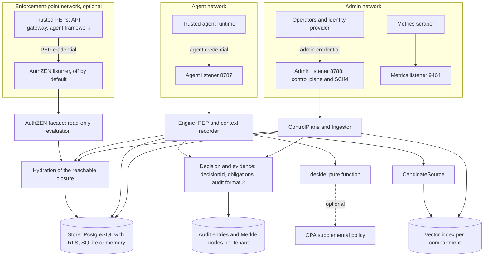

# Reference architecture (0.4)

## Listeners and credentials

| Listener | Port (default) | Serves | Credentials |
|---|---|---|---|
| Agent | 8787 | `/health`, `/ready`, `/v1/retrieve`, `/v1/contexts`, `/v1/derive`, `/v1/release` | Agent bindings (tenant, user, agent, grant) from a credentials file or a verified JWT |
| Admin | 8788 | `/admin/v1/*`, `/scim/v2/*`, audit read and NDJSON export | Administrator bindings (tenant, admin actor); a different population that the agent listener never accepts, and vice versa |
| AuthZEN (optional) | none; enabled by `AKAC_AUTHZEN_PORT`, default host `127.0.0.1` | `/access/v1/evaluation`, `/access/v1/evaluations`, `/.well-known/authzen-configuration` (only with a public URL), `/health` | PEP bindings (tenant, PEP) from a credentials file or a verified JWT with a distinct audience; agent and admin credentials are refused |
| Metrics | 9464 | `/metrics` in Prometheus text format | None; expose to the scraper network only |

The admin listener starts only when admin credentials are configured. The tenant always comes from the credential, never from a request body or a token claim. Authority for each admin call comes from the administrator's standing role (`security-admin`, `kb-admin`, `auditor`), checked and audited by the control plane. The listeners are separate so that the network layer can keep them apart; nothing in the process prevents an operator from publishing both on one ingress, so deployment must not.

## 0.4 components

| Component | File | Role |
|---|---|---|
| Decision records and obligations | `reference/decision.ts` | Closed reason codes, `policyDigest`, obligation set, strict validation, `enforceable()` for enforcement points |
| Canonical JSON | `reference/jcs.ts` | RFC 8785 form for the JSON subset the evidence uses; rejects everything else |
| Merkle tree and proofs | `reference/merkle.ts` | RFC 9162 root, inclusion and consistency proofs and their verifiers |
| Audit and checkpoints | `reference/audit.ts`, `reference/checkpoint.ts`, `reference/evidence.ts` | Format 1 and 2 entries, per-entry hash rule, chain across formats, checkpoint formats 1 and 2, evidence routes for the auditor role |
| Lifecycle | `reference/lifecycle.ts` and the lifecycle methods of `ControlPlane` and `Ingestor` | Quarantine, release, lineage listing, cascade erasure, legal hold, retention batches, scanner hook |
| Destinations | `reference/policy.ts` (release gate), `reference/engine.ts` | Destination profile and run restriction checks that only narrow the 0.3 recipient check; `Engine.evaluate` is the read-only variant |
| Token binding | `adapters/dpop.ts`, `adapters/dpop-postgres.ts`, `adapters/jwt.ts` | DPoP proof validation, `cnf.jkt` binding, replay store (memory or PostgreSQL) |
| AuthZEN facade | `reference/authzen.ts` | Mapping profile, batch semantics, its own listener, credentials and limits |
| Adversarial conformance | `conformance/run.ts`, `conformance/outcome.ts`, `conformance/scenarios.ts` | Outcome classes, gates, manifest, multi-step scenario vectors |

**Lifecycle in the decision function.** `visible()` walks the provenance DAG and rejects any node that is inactive or carries a `lifecycle` value, so quarantine and erasure are one more check in the existing walk, not a new code path (ADR-007). Quarantining a record therefore hides its lineage at every gate without rewriting the lineage, and every retrieval candidate is re-checked. Erasure replaces content with a tombstone, cascades over the lineage within a bound or changes nothing, and is blocked by a legal hold anywhere in the lineage.

**Destinations.** A release names a recipient principal; the recipient's optional `destination` profile adds a classification ceiling, a purpose list and a class, and the grant may restrict the run to classes or profiles. The allow carries `destination_restricted`. AKAC records and decides; the egress path enforces (the integration guide).

**AuthZEN facade.** A separate listener for enforcement points that asks "would AKAC permit this now?". It hydrates one tenant snapshot, applies `decide()` and the supplemental policy exactly like the engine, audits the evaluation and returns the decision id as `context.id`. It cannot open a context, read content or select a tenant. It duplicates a small part of the engine's supplemental-policy handling (ADR-011); a parity test compares it with `decide()` and `openContext()`.

**Sender-constrained tokens.** DPoP proofs are verified in the gateway against a configured public URL; the authenticator compares `cnf.jkt` with the proof key thumbprint. A token with `cnf` never works as a bearer token. Replay state is bounded and shared through PostgreSQL when configured.

## 0.5: runtime containment

| Component | File | Role |
|---|---|---|
| Runtime profile derivation | `reference/containment.ts`, `reference/engine.ts` | Per-tenant policies to `runtime_profile` and `max_output_classification` obligations; conflicts deny |
| Runtime enforcer seam | `reference/runtime.ts` | Execution-scoped `RuntimeEnforcer` applied by `ProtectedRuntime` before the provider (serialized unless the enforcer is `per-execution`); the revision is re-checked before release and audited |
| Storage | `migrations/008_runtime_profiles.sql`, `adapters/postgres.ts`, `reference/store.ts` | `akac_runtime_profiles` (forced RLS); audit columns `execution_id`, `runtime_revision` |

AKAC names profile ids; the runtime maps them to its own reviewed templates and enforces them out of band ([RUNTIME-CONTAINMENT.md](RUNTIME-CONTAINMENT.md), [ADR-012](../governance/ADR-012-runtime-containment-contract.md)).

**Not an enforcement claim.** Cache isolation (R91-R99), sandboxing and egress enforcement are integration duties that these components support with signals and decisions but cannot carry out.

## Decision and enforcement

`reference/policy.ts` is a deterministic function over an authoritative snapshot. It performs no I/O. The mandatory safety boundary is evaluated first, in a fixed check order that yields a category (`deny` or `defer`) and an internal code. `adapters/opa.ts` optionally evaluates company policy; only an exact JSON boolean true can pass, and the policy receives the highest effective classification over the object's whole source graph. No policy timeout, undefined result or exception can turn a deny into an allow.

`reference/engine.ts` is the PEP and context recorder. It checks all effective restrictions, records provenance and writes audit events. The HTTP transport binds credentials to a tenant/user/agent/grant tuple; request JSON cannot change that tuple. This is not a standalone isolation system. Run it behind a trusted orchestration service that owns model credentials and mediates every tool. Never expose a powerful agent token to a lower-privileged end user.

## Storage, hydration and atomicity

Every store implements `transaction(tenant, fn)`. The engine hydrates the closure a decision can reach (`reference/hydrate.ts`): grant ancestry, principals, group memberships, role hierarchy, sources, containers, run contexts, constraints and the tenant epoch. It then evaluates the pure decision over that snapshot. Authorization, derivation or revocation and the audit append commit together, and failed persistence returns no protected result.

A load is never silently truncated. Bounds count requested names (including names with no record, because a role name without a record reads as a flat role), and a store either returns everything requested or aborts; the engine then denies with category `defer` and audits `DEFERRED:BUDGET_EXCEEDED`. A failed transaction is audited best effort as `DEFERRED:STORE_ERROR` in a separate transaction.

MemoryStore and SQLite hold each tenant's full state and are partitioned per tenant, but serialize work with one coarse transaction; SQLite (BEGIN IMMEDIATE, WAL, FULL synchronous, one gateway process) is a single-node developer mode. PostgreSQL uses the normalized schema in `migrations/` ([ADR-005](../governance/ADR-005-normalized-storage.md)):

* tables per record type with keys `(tenant, id)`, so the same identifier in two tenants is two unrelated records and a write cannot move a record across tenants;
* row-level security on the transaction-local `akac.tenant`, **forced** for the table owner, in addition to explicit tenant filters in every load;
* a per-tenant advisory lock, so one tenant's authorize-act-audit transaction is linearizable while tenants proceed in parallel;
* per-tenant audit streams with a head row, and change-detected write-back;
* versioned migrations run by the schema owner (`scripts/migrate.ts` or `AKAC_AUTO_MIGRATE`) under an advisory lock with checksum verification; an applied migration is never edited.

The gateway connects as a runtime role that must be neither superuser nor `BYPASSRLS`. It refuses to start, fails readiness and fails transactions closed otherwise; `AKAC_PG_ALLOW_BYPASS_RLS=true` is a local-development opt-out that production refuses. Database credentials, files and backups must be protected independently.

In Compose, PostgreSQL and OPA stay on an internal network; the agent listener joins an `ingress` network and the admin and metrics listeners an `admin` network, all published to loopback for the demonstration. Bridges are not a model or network sandbox and do not replace deployment egress controls.

## Roles, groups and containers

Effective roles are the closure of directly assigned and active-group roles over active same-tenant role records (bounded: 64 roles, 16 levels, cycles deny). A role name without a record is a flat 0.2 role. Static separation-of-duty constraints invalidate a principal for every decision; dynamic constraints apply to a grant's activated roles (all roles when no activation is given). Knowledge may sit in a knowledge base or folder; every ancestor container's audience must be satisfied and its classification acts as a floor (chain depth bound 32). `effectiveLabel()` exposes the resulting classification, projects and conjunctive audience clauses for indexers.

## Retrieval and the vector index

`Engine` accepts a `CandidateSource`. The engine derives pre-filter tokens (`principalTokens`) and the compartment ceiling (`effectiveClearance`, the minimum of user and agent clearance) in a short transaction, queries the source outside the tenant lock, then re-authorizes every candidate with `decide()` inside the transaction. Failures are dropped, counted (`stats().filterMismatches`, `akac_filter_mismatch_total`) and never observable to the caller. An unavailable source denies. Without a source, a bounded lexical scan is used, limited to 1,000 records and 64 MiB of content.

With `AKAC_RETRIEVAL=vector`, `VectorCandidateSource` embeds the query and asks a `VectorIndex` for candidates only in compartments up to the ceiling. Implementations: `MemoryVectorIndex` (development), `PgVectorIndex` (one table per classification, forced RLS, token pre-filter inside the nearest-neighbour statement, HNSW), and `RoutedVectorIndex`, which can send the `restricted` compartment to a dedicated database. Scores are computed over chunks that passed the pre-filter only. See [retrieval](RETRIEVAL.md) and [ADR-004](../governance/ADR-004-knowledge-base-partitioning.md).

## Ingestion and reconciliation

Administrative writes go through `ControlPlane` (`reference/control.ts`), which is not exposed on the agent API. With vector retrieval the `Ingestor` (`reference/ingest.ts`) wraps document writes: an authorized (kb-admin, audited) upsert, then chunking, embedding and atomic replacement of the document's chunks, with chunk labels derived from `effectiveLabel()` and never from content. If indexing fails after the authoritative write, the document remains authoritative but unindexed (`INDEX_PENDING`, HTTP 202). `reconcile` (`POST /admin/v1/index/reconcile` or `scripts/reconcile.ts`) plans from metadata, loads content only for documents it re-indexes in batches, removes chunks of inactive or expired documents, and repairs relabels and model changes. An index failure can never make a document more readable than the record allows. Model-origin content is refused at ingestion.

## Run manifests

The grant ID identifies one isolated run for one user and agent. All contexts for that binding are accumulated, including when an older handle is presented, so new reads cannot be omitted by selecting an older context. The reference limits each request to 64 sources, a cumulative run to 128 direct sources and a context lifetime to five minutes or the grant expiry, whichever is sooner. Revoked or expired run contexts cannot be revived; the trusted control plane must create a fresh isolated run and grant.

Derived artifacts retain exact source ID/version edges. Their local ACL is only a first check; every source ACL is checked recursively. A missing, revoked, cyclic, changed or inaccessible source blocks access. This is conservative lazy revocation, not a background deletion claim.

## Revocation

An administrative revoke marks a target inactive and advances the revoking tenant's epoch, which invalidates that tenant's contexts only; updates to existing roles, groups, containers, documents and actors, and retiring a document, do the same. Version and epoch checks and the per-tenant lock prevent a later transaction from using a stale decision. SCIM `DELETE /Users/{id}` revokes the user.

The linearization point is transaction commit. Bytes authorized before that point may arrive afterward; a successful revocation cannot recall an in-flight network response. Downstream runtimes must discard affected model sessions and caches. The adapter MUST NOT acknowledge stronger end-to-end revocation than it enforces.

## Audit

Audit records form one hash chain per tenant, with ordered sequence numbers, rule version and tenant epoch. Since 0.4 new entries use format 2: they add `decisionId`, `reasonCode`, `policyDigest`, `obligations` and, where applicable, `runId` and `traceId`, and are hashed over the RFC 8785 form; the chain continues across the change and verifiers select the rule per entry. Each tenant stream is also committed to by an RFC 9162 Merkle tree whose nodes PostgreSQL stores per tenant (`akac_audit_node`, append-only, forced row-level security); an auditor obtains the tree head and inclusion and consistency proofs over the admin listener, and checkpoint format 2 signs the root so that a later checkpoint must extend an earlier one. Reasons carry the internal decision category and code (for example `DENIED:KNOWLEDGE_BOUNDARY`, `DEFERRED:INVALID_CONTEXT`); HTTP responses do not. Every administrative attempt is audited, including denials, idempotent replays and failed transactions. This detects accidental edits when compared against a trusted checkpoint (Ed25519 signed checkpoints, per tenant). It does not resist a database administrator rewriting the entire chain. Production deployments need an independently protected append-only/WORM or signed audit sink. Content and queries are not recorded in audit entries.

## Observability

A separate metrics listener exposes Prometheus counters and histograms with closed label sets (route templates, status, operation, reason class); tenant, subject, resource, query, token and content never appear as labels. Structured JSON logs carry request and trace ids and no content or credentials. Filter mismatches, candidate-source failures, index writes, pending documents and reconcile runs are counted. Counters are per process. Production alerting, incident handling and operating procedures must be established and tested by the operator; they are not an assurance claim of this reference.

## Extension contracts

SSO, external object stores, model endpoints and transport delivery are adapter boundaries. Vector search is a `CandidateSource` and `VectorIndex` boundary. No permissive fallback is allowed if a required adapter cannot enforce its obligation. Declassification and federation are denied in this reference rather than simulated.
